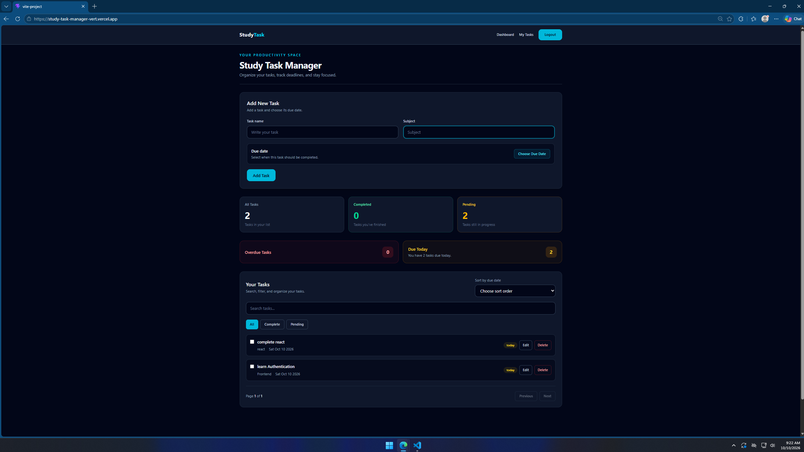
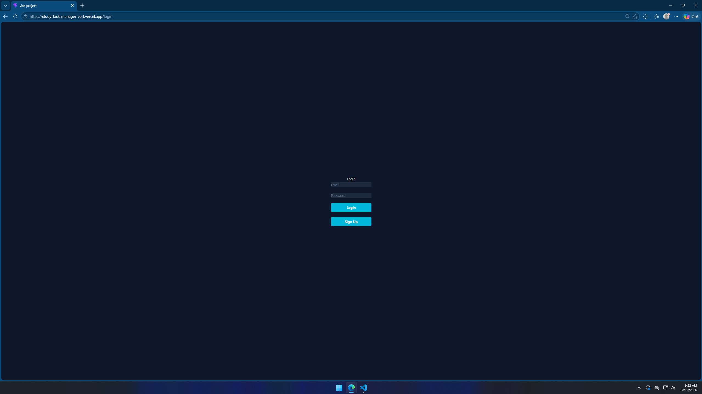
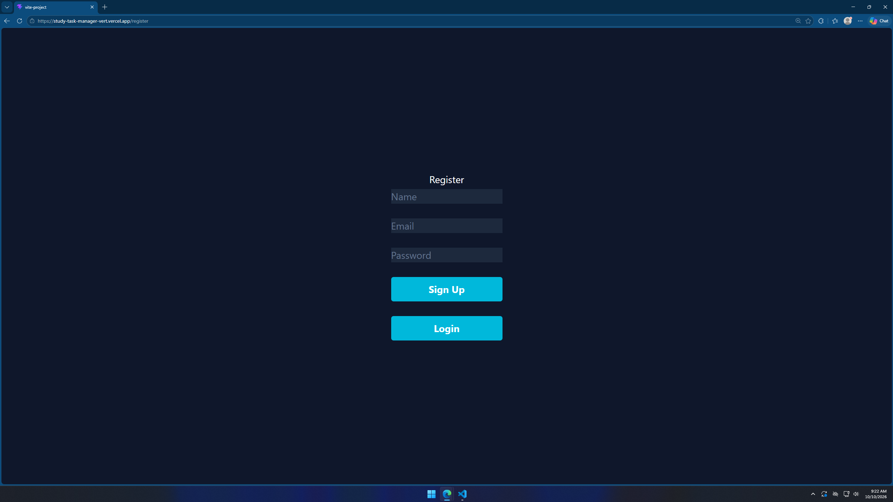

# Study Task Manager

A full-stack web application that helps students organize their study tasks, track completion, and manage deadlines. Built using the MERN stack.


## Live Demo

- **Frontend:** [https://study-task-manager-vert.vercel.app](https://study-task-manager-vert.vercel.app)
- **Backend:** [https://studytaskmanager-8il9.onrender.com](https://studytaskmanager-8il9.onrender.com)
- **GitHub Repository:** [https://github.com/sudhir45raj-del/StudyTaskManager](https://github.com/sudhir45raj-del/StudyTaskManager)

## About the Project

Study Task Manager is a personal project built to practice full-stack web development. It allows users to create an account, log in, and manage their study tasks through a web interface.

The project helped me understand how a React frontend communicates with an Express backend, how MongoDB stores application data, and how authentication protects user-specific resources.

## Screenshots

### Main Dashboard


### User Authentication
| Login Page | Registration Page |
| :---: | :---: |
|  |  |

## Features

- User registration and login
- JWT-based authentication
- Protected frontend routes
- Create, read, update, and delete study tasks
- Mark tasks as completed or incomplete
- Store task information in MongoDB
- Associate tasks with individual users
- Protect task operations so users can access only their own tasks
- Responsive user interface
- Deployed frontend and backend

## Tech Stack

**Frontend**

- React
- Vite
- JavaScript
- Tailwind CSS
- React Router

**Backend**

- Node.js
- Express.js
- JWT authentication
- bcrypt for password hashing

**Database**

- MongoDB Atlas
- Mongoose

**Deployment and Tools**

- Vercel — frontend hosting
- Render — backend hosting
- Git and GitHub — version control

## Application Architecture

The application follows a client-server architecture.

1. The user interacts with the React frontend.
2. The frontend sends HTTP requests to the Express API.
3. Authentication middleware verifies protected requests.
4. Express uses Mongoose to interact with MongoDB.
5. The backend returns a response to the frontend.

```text
User
  |
  v
React + Vite (Vercel)
  |
  | HTTP requests + JWT
  v
Express + Node.js (Render)
  |
  v
MongoDB Atlas
```

## Getting Started

### Prerequisites

Install the following:

- Node.js and npm
- Git
- A MongoDB Atlas account, or another compatible MongoDB database

### 1. Clone the repository

```bash
git clone https://github.com/sudhir45raj-del/StudyTaskManager.git
cd StudyTaskManager
```

### 2. Install frontend dependencies

From the project root:

```bash
npm install
```

### 3. Configure the frontend environment

Create a `.env` file in the project root:

```env
VITE_API_URL=http://localhost:5000/api
```

### 4. Install backend dependencies

```bash
cd backend
npm install
```

### 5. Configure backend environment variables

Create `backend/.env`:

```env
MONGODB_URI=your_mongodb_connection_string
JWT_SECRET=your_long_random_secret
PORT=5000
```

Replace the example values with your own configuration. Never commit actual secrets to GitHub.

### 6. Start the backend

From the `backend` directory:

```bash
npm start
```

### 7. Start the frontend

Open a second terminal in the project root:

```bash
npm run dev
```

Open the local URL printed by Vite in your browser.

## Environment Configuration

The frontend uses `VITE_API_URL` to determine which backend API to call.

For local development:

```env
VITE_API_URL=http://localhost:5000/api
```

For the deployed frontend, configure this variable in Vercel:

```text
VITE_API_URL=https://studytaskmanager-8il9.onrender.com/api
```

Vite environment variables prefixed with `VITE_` are exposed to browser-side code. Do not put database credentials, JWT signing secrets, or other private values in them.

The backend uses `MONGODB_URI`, `JWT_SECRET`, and optionally `PORT`. Configure these in the backend's local environment file or the backend hosting provider.

## What I Learned

While building and deploying this project, I learned how to:

- Build reusable React components and manage state.
- Implement forms and user authentication.
- Create REST API endpoints using Express.
- Hash passwords using bcrypt and issue JWTs.
- Protect routes with authentication middleware.
- Associate database records with authenticated users.
- Implement task CRUD operations.
- Configure environment variables for development and production.
- Deploy a frontend to Vercel and a backend to Render.
- Debug production errors using browser DevTools, Network requests, and deployment logs.
- Diagnose incorrect API URLs, route mismatches, and React Router deployment issues.

## Future Improvements

Possible improvements include:

- Better loading, error, and empty states.
- Task search, filtering, and sorting.
- Improved deadline reminders.
- Automated tests for API endpoints.
- Stronger production security and validation.
- Accessibility and user experience improvements.

## Author

**Sudhir — Aspiring Full-Stack Web Developer**

GitHub: [https://github.com/sudhir45raj-del](https://github.com/sudhir45raj-del)

This project is part of my journey toward becoming an independent full-stack web developer.
